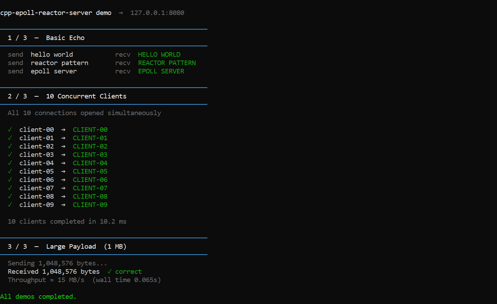

# C++ Epoll Reactor Server

[](https://github.com/Gaurav-t27/cpp-epoll-reactor-server/actions/workflows/ci.yml)

A Linux based non-blocking TCP server using the epoll, single threaded event loop and reactor pattern. This project demonstrates modern C++ non-blocking networking techniques, resource management and event handling.

## Features

- **Reactor pattern** with edge-triggered epoll (`EPOLLET`)
- **Non-blocking I/O** with proper EAGAIN handling
- **Flow control** with 64KB write buffer threshold
- **Async-signal-safe shutdown** using eventfd
- **Modern C++17** with RAII and zero-copy where possible

## Quick Start

### With Docker
```bash
docker compose up
```
Server is now listening on port 8080. No compiler or build tools required.

### From source
```bash
cmake -S . -B build && cmake --build build --parallel
./build/bin/tcp_server
```

### Try it
```bash
echo "hello world" | nc localhost 8080
# HELLO WORLD
```

## Demo



```bash
# With the server running (Docker or local):
python3 demo/demo.py
```

Shows basic echo, 10 concurrent clients, and a 1 MB payload transfer with throughput measurement.
See [demo/README.md](demo/README.md) for details.

## Requirements

- Linux (epoll required - no Windows support)
- GCC 9+ or Clang 10+ with C++17
- CMake 3.16+
- Python 3.6+ (for integration tests and demo)

## Testing

```bash
# Unit tests (Catch2)
./build/bin/unit_tests

# Integration tests (Python unittest)
python3 tests/run_tests.py

# All tests with CTest
ctest --test-dir build --output-on-failure
```

## Architecture

```
Reactor (epoll event loop)
  ├─ Socket (RAII wrapper)
  ├─ TCPServer (connection handler)
  └─ eventfd (shutdown signal)
```

**Flow Control:** Pauses reads when write buffer ≥ 64KB, resumes at ≤ 32KB.

## Design choices

- **Reactor pattern:** Efficiently utilizes non-blocking IO
- **Epoll:** Provides O(1) scalability
- **Edge-Triggered mode:** Minimize number of system calls
- **Eventfd:** Safely handles async signals
- **Avoiding multi-reactor:** Event loop per cpu core is ideal, but adds confusion to this demo 
- **Avoiding worker thread pool:** Trivial business logic (converts input to uppercase)


## Known Limitations

- Linux-only (epoll API)
- Single-threaded (not thread-safe)
- No SSL/TLS support
- No connection timeouts

## License

MIT
